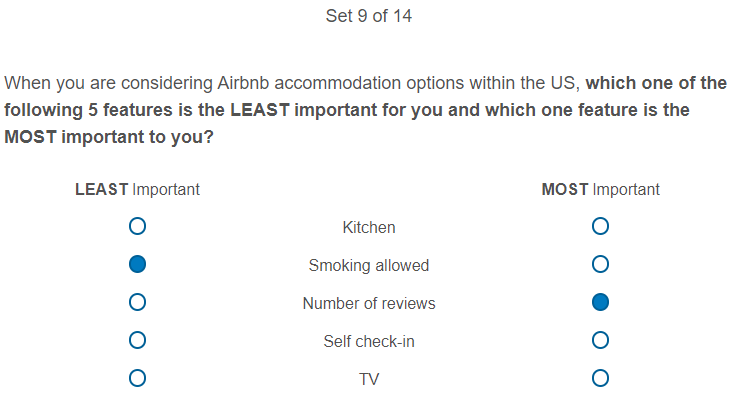

**Summary:** Airbnb has millions of users searching for accommodations around the world. Given the vast number of available listings, Airbnb recommends listings to users using an algorithm model that considers a number of various listing features and characteristics. Although Airbnb is transparent in which factors they consider influential to their recommendation algorithm, a key question is whether these factors align with users' perspectives. Through a MaxDiff survey and follow-up user interviews, findings indicated that price, location, and rating align well with users' perspectives, yet features such as self check-in, superhost status, and instant book were less important than expected.

**Role**: Individual Researcher

# Objectives

Our goal is to understand users' preferences for Airbnb listing features and whether Airbnb's recommendation algorithm align with users' feature preferences.

Aligning Airbnb's recommendation algorithm with users' perspectives and preferences ensures that the most appropriate accommodations are presented to Airbnb users. By providing accommodations aligned with users' needs, we can provide more personalized recommendations to reduce the time required for conversion. 

# Airbnb's Recommendation Algorithm

Airbnb is transparent about which features they use for their recommendation algorithm. Therefore, I used their specified features as comparisons. Three key characteristics are heavily prominent in their algorithm: **Quality, popularity,** and **price.** 

> **Quality.** The algorithm assesses many characteristics to evaluate quality, including the **listing photos, reviews of the listing, and listing characteristics.** Higher quality listings tend to rank higher in search.

> **Popularity.** The algorithm evaluates the popularity of a listing using a wide range of information, including **how guests engage with the listing** and **how often the listing gets booked.** Examples of guest engagement with a listing include how often guests save a listing to their wish list, how often guests book, and **how often guests message the Host.** More popular listings tend to rank higher in search.

> **Price.** To determine how attractive the price of a listing is, the algorithm considers a variety of price data, including **how the price compares to similar listings** in the area for the given dates. Listings that are priced below other comparable listings—other listings in the area with similar guest capacity and amenities—tend to rank higher in search.

Other factors that influence search results:
* Location
* High quality listing photos
* Accurate list of amenities
* Superhost status
* Instant booking
* Guest influence

To focus on features selectable by users, 7 features were selected as core influencers of Airbnb's recommendation algorithm:
* Price
* Ratings
* Number of reviews
* Distance from the desired area
* High Quality Listing Photos
* Superhost status
* Instant book

## Goals

* Identify which Airbnb listing features/characteristics that are most or least important when selecting accommodation.

* Identify whether users' perceived feature importance matches the current recommendation algorithm.

## Target Population and Constraints

* Airbnb users

* College graduate students and young professionals residing in the US

* Accommodation in the US

# Method

Two methods were used to collect participant data.

* A **MaxDiff** survey was administered to understand users' ranked preferences of listing features.

* Follow-up **user interviews** were conducted to explore users' responses in detail.

## MaxDiff

A MaxDiff survey is similar to a conjoint analysis whereby individuals are forced to make a choice between multiple items.

Advantages of the MaxDiff survey:
* **Good discrimination among items** as participants are forced to select their most preferred and least preferred feature from a small subset of items, rather than rating everything as a 4 or 5 out of 5 for importance.
* **Minimizes scale use bias** in that "most" and "least" is consistent across diverse participant demographics in contrast to Likert-Like scales developing different response bias.

* **Easy to administer**.

* Works well with a **small number of participants**.

### Identifying Comparable Features

1. Collate all available features to filter on Airbnb.
2. Pre-test **user interviews** with 3 individuals to discuss comparable features
* Discussed combining features that were relevant (e.g., smoke alarm and carbon monoxide alarm)
* Identified uncertainty in features (e.g., what is considered "breakfast")
3. Define set list of target features
* Kept certain items together (e.g., air conditioning and heating; washer and dryer)
* Excluded accessibility features. Through discussion with others, we did not want to overshadow accessibility needs when recruiting from the general population.
4. **Cognitive walkthrough** when pilot testing the survey to identify areas of confusion and add explanations at the start of the survey.

The final survey included 24 features with the following question and items (bold indicates feature involved in Airbnb recommendation algorithm):

"When you are considering Airbnb accommodation options within the US, **which one of the following 5 features is the LEAST important for you and which one feature is the MOST important to you?**"

| | Listed Features for Comparison | |
| - | - | - |
| **Number of reviews** | **Accommodation rating** | **Price** |
| **Instant book** | **Distance from the desired area** | **High quality listing photos** |
| **Superhost** | Dedicated workspace | Hair dryer |
| Kitchen | TV | Washer / Dryer |
| Wifi | Free parking | Hot tub |
| Indoor fireplace | Pool | Smoking allowed |
| Host language | Air conditioning / Heating | Self check-in |
| Airbnb plus | Smoke alarm and/or carbon monoxide alarm | (Clothes) Iron |

With a MaxDiff survey, participants were provided with 14 sets of questions with each set presenting 5 random features. 

# Findings

## Survey

Using data from 28 respondents:

* **Price** has greatest relative preference in listing features.
* Next is **distance** and **accommodation rating**, followed by **wifi** and **air conditioning/heating**.
* Only slightly positive preference for **Superhost status** and **high quality listing photos**.
* Relatively little positive or negative preference for **Airbnb Plus** and **Instant Book**.
* **Fireplace** consistently rated the least preferred feature.

## Interviews

Follow-up **user interviews** with 4 participants found several insights:

### Misalignment of what key Airbnb features are
Participants were confused on what **Superhost** and **Airbnb plus** was.
> **Superhost:** "A Superhost is a nice feature if I am willing to give up autonomy"

> **Airbnb Plus:** "It'd be less overall fees potentially, or it's like all fees grouped together in one go ... I know that's probably not the right definition."

### Accommodation ratings and review number have a complicated relationship
Accommodation rating generally had greater preference than the total number of reviews, yet participants would skim reviews to make their final determination.

> "I will take more risks with fewer reviews because everyone has to start somewhere ... I would prefer a 4.6/5 with 100 reviews over a 4.8/5 with 5 reviews."

### Host interaction (well, lack of) matters!
Participants mentioned preference against interacting with a host at the accommodation, sometimes assuming host interaction is a part of Superhost status.

> "I don't really prioritize the social interaction of the host. I don't always know who the host is. Sometimes they're a little weird."

### Physical self check-ins can be a scavenger hunt!
One participant mentioned a bad experience of trying to search for a physical key external to the accommodation, but had good experiences with digital self check-ins.

> "They sent me photos of where to find the key. I have to walk out from the apartment, turn right, find a tree, and the key lock is under the tree. What would happen if someone decided to cut that tree? or if there was a storm or something?"

# Practical Recommendations
* Enhance understanding of Airbnb specific terms such as Superhost and Airbnb Plus.
* Add a "general vibe" of reviews.
* Restructure what listing characteristics users can filter by:
+ Enhance visibility of potential in-person host interactions.
+ Differentiate physical and digital self check-ins.

# Reflection

* Qualtrics is a good start at conceptualizing and learning the MaxDiff survey; however, a dedicated survey tool (e.g., Sawtooth Software) would be better if administering MaxDiff consistently.

