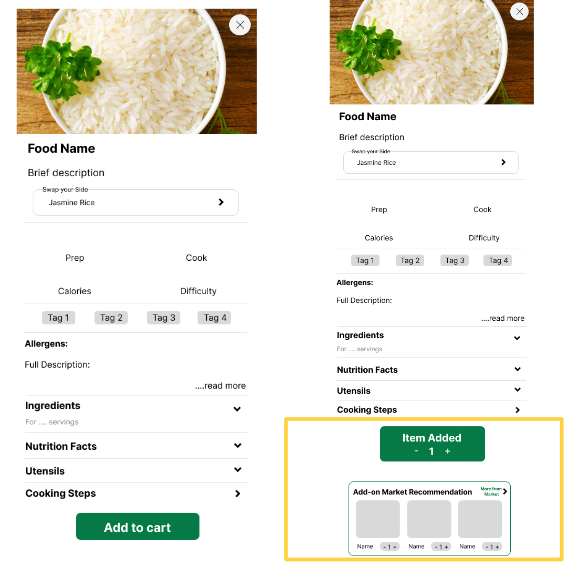

A 12-hour "hackathon" style usability competition sponsored by HelloFresh. The overall objective was to **provide a market experience to users**, **create a better flow for app navigation**, and **improve the personalization of the app experience.**

## **Background**

HelloFresh is a global meal-kit subscription service that sends users a box of pre-portioned ingredients and recipe cards each week. Certain meal options nudge users to add a Market item directly from the Menu to pair with that meal (e.g., garlic bread, side salad, dessert item, etc). The HelloFresh Market offers items coined as "add-ons" or "extras", appearing on a separate page after a user has saved their meal selection. 

**Role**: Researcher in team of four

## **Objectives**

Our goal is to provide a Market experience where **users are able to add items to their order without friction or hesitation**, are inspired by the options available in the Market, and are confident that their order will meet their unique needs.

Based on our research, the biggest area of opportunity for the Market is **improving or replacing the bifurcated meal selection flow**. By providing simple entry points and paths for adding and saving Market selections, we can reduce friction and increase conversion. Additional opportunities include **better framing and describing the Market more effectively, increasing trust in the Market items, and improving in-Market navigation**. 

## **Main Goals**

* Mobile-first design
* Accessible flow to market between Menu and Market before and during meal selection
* Intuitive In-Market navigation organization
* Personalization for product fit and relevance
* Concise, informative categories and relevant Market onboarding

## **Research Phase**

For this portion, our team focused on:

* **Rapid Personas** to understand who our target users were
* **Rapid Empathy Map** to visualize what we know about the target users 
* **Competitor** Analysis to understand the strengths and growth areas of other meal-delivery apps
* **SME Interview** to quickly understand how a user engages the application and to identify possible pain points

## **SME Interview Findings**

* App navigation difficult

*"I have to keep scrolling up and down to see the meals that I've selected ... trying to get back to the market is hard"*

* Discontinued changing preferences - lack of food exclusion

*"I don't think there's a way to exclude items ... I look for meals with the fewest amount of ingredients that I need to swap"*

* Has set process after trial and error with the app

*"I think most people just investigate and figure out on their own ... I start off with veggies and I add meat"*

## **Prototype Phase**

For this portion, our team focused on:

* **Pen & Paper wireframes** with each member creating a design in parallel; reviewing each design and identifying aligning features 
* **Low-fidelity prototype** via Figma
* **User testing** to evaluate potential areas of confusion in our prototype
* **Medium-fidelity prototype** taking user feedback into consideration 

## **User Testing Focus Points:**

* Cart clarity and comprehension
* In-item selection market recommendations
* Meal kit and Market categorization

## **Final Prototype**

In line with the goals of our project, our application prioritized a **mobile first design** as the large majority of Hello Fresh users use the mobile application.

Next, we focused on **market accessibility** so that users can navigate across pages without friction during all stages of their ordering journey. 

**In-market navigation** was more efficiently organized so that users could browse items more easily.

Finally, we made **personalization features** more salient for dietary restrictions.

Shown below are the key areas of improvement that our team cultivated:

### Consistent navbar that can switch between My Meals, Meal Kits, and Market

### Improved market recommendation after adding item

### Specific Market categories to select relevant, individual meals

### Meal kits categorized using dropdown menus for easy access and navigation

### Cart overlay allows easy editing before checking out

### Editing preferences easily accessible to choose dietary restrictions or exclude food items

Final prototype can be found here [click here to access prototype](https://www.figma.com/proto/HBCPLmRFpL8i7MgJFwLTAK/HelloFresh-Usabilathon?node-id=3-2&scaling=scale-down&page-id=0%3A1&starting-point-node-id=3%3A2)

## **Key Recommendations:**

* Incorporate a navigation bar that is consistent with users' mental models for easily switching between meal kits and marketplace items
* Enhance flow efficiency of Market categories and item recommendations
* Include an accessible food preferences page to choose dietary restrictions or exclude specific food groups
