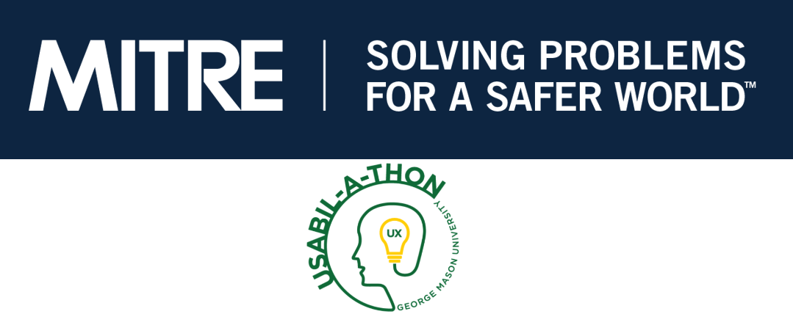

A 12-hour "hackathon" style usability competition hosted by MITRE. The overall objective was to devise a solution that enables active collaboration from different stakeholders for Mitre's Social Justice Platform website.

## **Background**
MITRE created a social justice platform website (sjp.mitre.org) which aims to be a resource for decision-makers by providing data, tools, and framework that address social justice challenges and enabling collaboration on solutions to those challenges.

## **Goals**

Enable users to do the following:
- Upload content that is relevant to the topics being addressed on the site
- Suggest new content that is discoverable within the navigation structure of the site for a particular social justice topic
- Moderate content that is posted
- Engage in active collaborative work via tools and data available on the site

Target users included MITRE administrators, academic researchers, government agencies, data scientists, and communities impacted by social injustice.

## **Method**

For this challenge, our team split into two teams – design and research.
The design team created:
- **Rapid personas** to understand who our target users were
- **Empathy maps** to visualize what we know about the target users
- **Journey maps** to identify how users would interact with the resources.

The research team focused on:
- **User interviews** with SME. 

As part of the research team, I conducted interviews exploring users' motivations, needs, and challenges in engaging with a collaborative website. 

Afterward, the two teams came together and, using **post-it note brainstorming**, we identified potential pain points that needed to be addressed and began to form a **pen-and-paper wireframe**. 

Next, we evaluated the initial wireframe through further **user testing**, identifying areas of confusion. We created a **low-fidelity prototype** that improved our initial wireframe, which was evaluated during the second iteration of user testing. This final iteration provided insight to improve our product before a 10-minute presentation.

Overall, we were able to understand the pain points of our different users and design a prototype that mitigated these frustrations. Additionally, through user interviews, we strategically incorporated a community feature to personally contact resource contributors and enhanced flow efficiency for moderating resources.

## **Recommendations**
- Clearly define distinctions in jargon.
- Highlight relevant content in close proximity to the resource.
- Categorize user submissions under review.
- Create community interaction through direct messaging and reactions to resources.

## **Lessons learned**
- 12 hours goes by quickly!
- Spend critical time to plan and adhere to a timeline.
- Overestimate the time required and adjust accordingly.
- Delegate interviewing and taking notes to effectively listen to users. 
